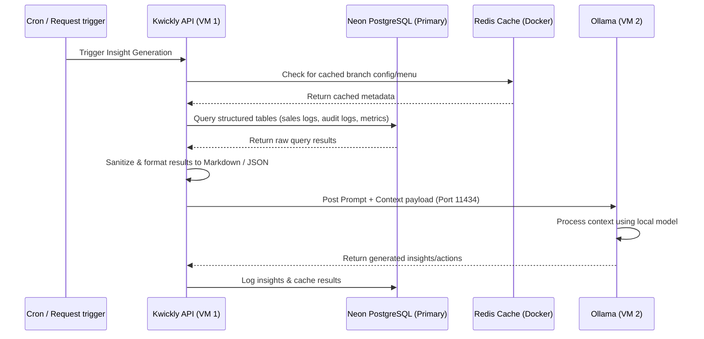

# Local AI Context Retrieval Design

This document details the architecture, retrieval patterns, and security guidelines for feeding system context into Kwickly's local LLM (**Ollama**). It describes how the API retrieves, sanitizes, and structures application data to generate intelligent insights (RAG - Retrieval-Augmented Generation) without compromising performance or data privacy.

---

## 1. Context Retrieval Lifecycle

To generate insights (e.g., sales trends, operational anomalies, inventory alerts), the system performs a multi-step context retrieval and injection pipeline:



---

## 2. Core Context Sources

Kwickly's API combines multiple data layers to construct a rich context payload:

| Data Layer | Source | Contents | Retrieval Purpose |
| :--- | :--- | :--- | :--- |
| **Sales & Orders** | Neon DB | Order volumes, ticket sizes, item sales | Performance analysis, busy-hour predictions |
| **Audit Logs** | Neon DB | Mutation logs from `auditPlugin` | Staff operations, security tracking, actions |
| **System Cache** | Redis | Branch configs, menu structures | Lightweight static metadata (speeds up requests) |
| **System Metrics** | VM Logs | CPU, memory, API latency logs | Performance troubleshooting and alerts |

---

## 3. Formatting Context for Local LLMs

Local open-source models (like Llama-3, Qwen-2.5, or Mistral) perform best when context is highly structured and dense. The Kwickly API formats raw database inputs using the following standards:

### Structured Markdown Tables
For tabular data like sales summaries, markdown formatting is used to conserve tokens while preserving structure:
```markdown
| Date | Branch | Daily Revenue | Total Orders | Top Category |
| :--- | :--- | :--- | :--- | :--- |
| 2026-06-27 | Branch A | ₹45,230.00 | 184 | Beverages |
| 2026-06-28 | Branch A | ₹52,110.00 | 212 | Hot Foods |
```

### Compact JSON blocks
For system configurations, compact JSON (whitespace stripped) is sent:
`{"branchId":"uuid-123","isActive":true,"operatingHours":"09:00-22:00"}`

---

## 4. Context Security & Sanitization

Since the LLM operates on a separate VM (`VM 2`), context must be aggressively sanitized before transport to prevent data leakage and command injection.

### Data Sanitization Checklist
The Kwickly API runs a sanitization middleware on any data sent to Ollama:
1. **Strip PII (Personally Identifiable Information):** Remove customer names, email addresses, phone numbers, and full home addresses. Use anonymized/hashed identifiers if tracking repeat customers is required.
2. **Filter Secrets:** Ensure database credentials, API keys (Razorpay, MSG91, OneSignal, etc.), password hashes, and JWT signatures are completely stripped from any config payloads.
3. **Truncate Oversized Content:** Local models have context window limits (typically 8k tokens). Implement pagination or rolling-window queries to ensure payloads do not exceed `4096 tokens` for safety and latency control.

### Read-Only Database Isolation
For AI-triggered database queries:
* The database connection pool used by the AI analytics runner uses a **restricted, read-only PostgreSQL role**.
* This prevents prompt-injection attacks on Ollama from executing destructive operations (like drops or updates) on your primary database.
