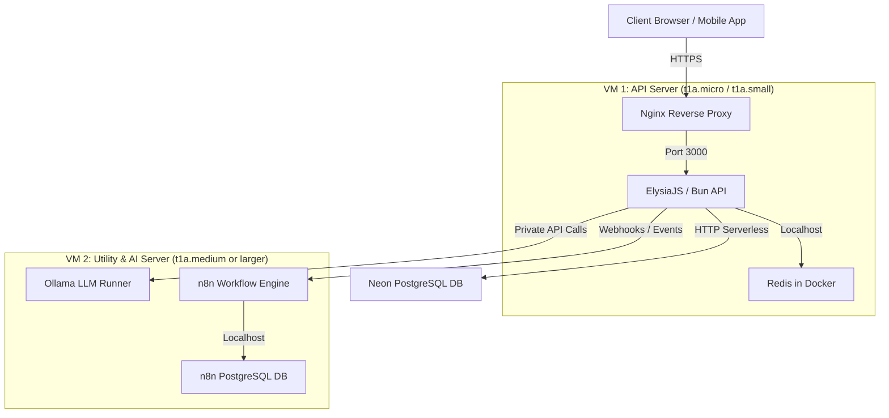

# Deployment Architecture & Services Layout

This document details the multi-instance deployment layout for the Kwickly API, local AI services (Ollama), workflow engines (n8n), and caching. It serves as the primary technical context for developers and AI agents managing or scaling this infrastructure.

---

## 1. High-Level Architecture Overview

To ensure high performance, security, and resource safety, the infrastructure is split into a **Dual-Server Layout** across isolated subnets.



---

## 2. Server Breakdown

### VM 1: Kwickly API Server
* **Type:** `t1a.micro` (2 vCPU, 1 GiB RAM) or `t1a.small` (2 vCPU, 2 GiB RAM)
* **OS:** Ubuntu 24.04
* **Purpose:** Handles customer-facing API routes with low latency.
* **Services Hosted:**
  * **Bun Runtime:** Runs the ElysiaJS app (port `3000`).
  * **PM2:** Manages the Bun process lifecycle.
  * **Nginx:** Acts as a reverse proxy, handling SSL termination (via Certbot) and routing external domain traffic.
  * **Redis (Dockerized):** Runs locally in Docker bound to `127.0.0.1:6379`.
* **Resource Profile:** Extremely lightweight. Bun + Elysia idle at ~50MB RAM. The Redis cache sits around ~10MB RAM.

### VM 2: Utility & AI Server
* **Type:** `t1a.medium` (2 vCPU, 4 GiB RAM) or larger CPU/GPU instance
* **OS:** Ubuntu 24.04
* **Purpose:** Hosts background workflows and the locally run LLM.
* **Services Hosted:**
  * **Ollama:** Manages the locally trained/fine-tuned LLMs used for app insights and data analysis (port `11434`).
  * **n8n:** Workflow automation engine (port `5678`).
  * **PostgreSQL (Dockerized):** Handles local n8n execution logging and workflow history.
* **Resource Profile:** Heavy. Loading a 1.5B–3B parameter model in Ollama requires 2–3 GiB RAM; a 7B model requires 5–6 GiB RAM. Running these on VM 1 would starve the API of memory, triggering OOM crashes.

---

## 3. Caching Architecture (Redis in Docker)

To keep the host operating system clean and simplify updates, Redis is run via Docker on VM 1.

* **Run Command:**
  ```bash
  docker run -d \
    --name kwickly-redis \
    -p 127.0.0.1:6379:6379 \
    -v redis_data:/data \
    --restart unless-stopped \
    redis:alpine
  ```
* **Security:** Binding to `127.0.0.1` ensures the Redis instance is only accessible internally on VM 1 and cannot be connected to via the public internet.
* **Persistence:** The `-v redis_data:/data` flag mounts a named Docker volume, preserving the cache keys if the container restarts.

---

## 4. Networking, Isolation & Security

### Subnet Division
* **Public Subnet (API):** Contains VM 1. Allows inbound traffic from `0.0.0.0/0` on port `80` (HTTP) and `443` (HTTPS) for API consumers.
* **Private/Utility Subnet:** Contains VM 2. 
  * n8n exposes its webhook port (`5678`) via Nginx proxy to the public internet for external webhooks.
  * Ollama (`11434`) is restricted at the Security Group level to **reject all public traffic**, accepting connections *only* from the private IP of VM 1.

### Security Groups (Firewalls)
* **API Security Group:**
  * Inbound: TCP `22` (SSH - restricted to developer IP), TCP `80`, TCP `443`.
  * Outbound: All traffic.
* **Utility Security Group:**
  * Inbound: TCP `22` (SSH), TCP `5678` (n8n webhooks), TCP `11434` (Ollama - allowed only from VM 1 Private IP).
  * Outbound: All traffic.

---

## 5. Deployment Pipelines (GitHub Actions)

### Continuous Integration (CI)
* Validates code quality on every PR/push to `main`.
* Leverages Bun actions to install dependencies and run linting/testing suites.

### Continuous Deployment (CD)
* Uses SSH keys to log in to VM 1.
* Triggers `/var/www/kwickly/kwickly-api/scripts/deploy/deploy_app.sh` to pull latest changes from Git, rebuild the typescript files using Bun, and reload the PM2 process.
